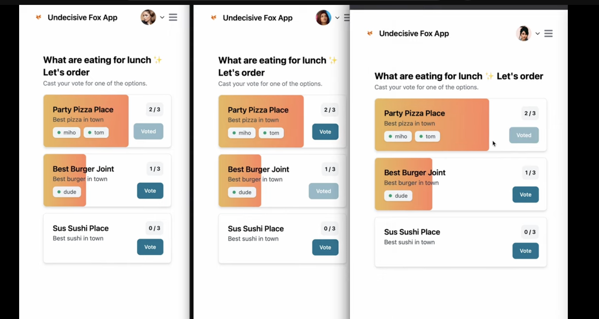

# Using Websockets with React & NodeJS
This example app is part of a tutorial on *How to build a real-time voting app with WebSockets, React, & Typescript*.

You can read the tutoiral [here](https://wasp-lang.dev/blog/2023/08/09/build-real-time-voting-app-websockets-react-typescript).

[](https://www.youtube.com/watch?v=Twy-2P0Co6M)

You can also check out the [Wasp version of this app](https://github.com/vincanger/websockets-wasp), which makes building with WebSockets **even easier**, as Wasp takes care of most of the boilerplate associated with building a full-stack React/NodeJS app.

## Running the app

Install the server dependencies
```bash
cd ws-server 
```

```bash
npm install
```
```bash
npm i --save-dev @types/cors
```

Run the server
```bash 
npm run start
```

Install the client dependencies
```bash
cd ws-client
```

```bash
npm install
```

Run the client
```bash
npm run dev
```

## Need Help?

Read the tutorial: [How to build a real-time voting app with WebSockets, React, & Typescript](https://wasp-lang.dev/blog/2023/08/09/build-real-time-voting-app-websockets-react-typescript).

Join the [Wasp Discord server](https://discord.gg/rzdnErX) and ask questions there. We are happy to help!